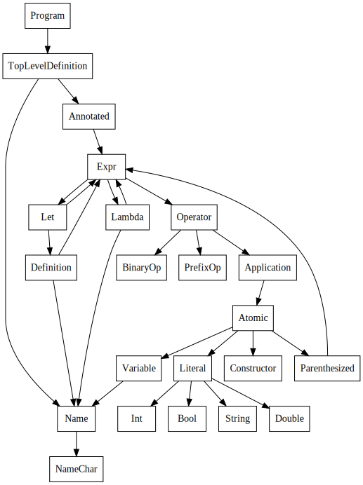

# Doldrums

&ldquo;You can swim all day in the Sea of Knowledge and not get wet.&rdquo;

&ndash; Norton Juster, _The Phantom Tollbooth_

## About

Doldrums is a small, purely functional programming language with an emphasis on ease of top-to-bottom understanding. I've been meaning to play with a language like this ever since making [Pixll](https://github.com/mitchellvitez/raspi-lights). This is a great way for me to learn. It's probably not very useful for anything in practice.

The compiler is written in Haskell. Run `stack run test.dol` to see an example.

### Structure

Compilation is split into several stages, and the code is split as well. The AST definition of the language lives in the `Language` module. Parsing happens in `Parse`, and typechecking in `Typecheck`. The `Template` module performs template instantiation to actually evaluate programs. 

The `runBase` function in `Lib` performs each stage of the compilation pipeline. In order, it parses a small prelude (written in Doldrums), reads an input file, parses, typechecks, evaluates, and shows the program's result.

## The Doldrums language

Doldrums is purely functional, which means that all values are immutable. It's also lazy, tiny, and pretty useless in the real world.

### Comments

```
-- Line comments look like this
```

```
/* Block comments
   look like this */
```

### Writing a program

A program is a list of functions. A function has a name, a list of arguments, and a body.

```
id x = x;
const x y = x;
```

You can define constants using a "function" with no arguments.
```
seven = 7;
```

Every program has a main function. This is what runs when the program starts.
```
main = const 6 7;
```

### The $ operator

Because it has the lowest precedence, you can use `$` to replace parentheses in certain situations, for cleaner code. For example, 

```
main = f (g (h x));
```

is equivalent to

```
main = f $ g $ h x;
```

### Let expressions

You can define variables to be used in an expression with `let`...`in`
```
let n = 0 in n
```

Multiple definitions should be separated by commas
```
let a = 1, b = 2, c = 3
in a * b * c
```

## Parsing

The parser uses [Megaparsec](https://hackage.haskell.org/package/megaparsec) and [`makeExprParser`](https://hackage.haskell.org/package/parser-combinators-1.3.0/docs/Control-Monad-Combinators-Expr.html#v:makeExprParser) from `parser-combinators`.

Here's a simplified call graph of the parsing code, showing its structure:



## Typechecking

The list of Doldrums types is short: `Bool`, `Int`, `Double`, `String`, `Constructor`, `TypeVariable`, and `:->` (the function type).

Doldrums uses Hindley-Milner style type inference to ensure that certain kinds of invalid programs aren't allowed. For example, this program will fail to typecheck:

```
func x = x + 7;
main = func "hello";
```

So will this one, since you can't apply literals:

```
main = 1 2 3;
```

The typechecking mechanism doesn't currently support recursion (however, the evaluator does). It's possible to work around these kinds of type errors by e.g. adding `fib : Int -> Int` to the listing of `primitiveTypes`.

```
fib n =
  if (n == 0) 1 $
  if (n == 1) 1 $
  fib (n - 1) + fib (n - 2);

main = fib 10;
```

This principle also blocks mutual recursion from typechecking.

```
g = f;
f = g;
main = f;
```

The opposite is true for lambda expressions: they parse and typecheck just fine, but the evaluator can't currently instantiate them.

```
main = (\x y. x) 3 4;
```

### Operator Precedence

Higher numbers mean higher precedence. All operators are binary (they have both a left and a right hand side).

Precedence | Associativity | Operator
-----------|---------------|---------
7          | left          | _function application_
6          | -             | `~`
6          | -             | `!`
5          | right         | `*`
5          | right         | `*.`
5          | right         | `/`
5          | right         | `/.`
4          | right         | `+`
4          | right         | `+.`
4          | right         | `-`
4          | right         | `-.`
3          | right         | `==`
3          | right         | `!=`
3          | right         | `>`
3          | right         | `>=`
3          | right         | `<`
3          | right         | `<=`
2          | right         | `&&`
1          | right         | `\|\|`
0          | right         | `$`

## How can I do this?

I'd recommend using Megaparsec or another parsing library to make that part easier to write. I got the Template Instantiation material (`src/Template.hs`) from [Implementing Functional Languages: a tutorial](https://www.microsoft.com/en-us/research/publication/implementing-functional-languages-a-tutorial). [Statically Typed Interpreters](https://www.youtube.com/watch?v=Ci2KF5hVuEs) was helpful when figuring out how to add the initial typechecking. Some issues were debugged more quickly thanks to help from friends. [Algorithm W Step by Step](https://citeseerx.ist.psu.edu/viewdoc/download?doi=10.1.1.65.7733&rep=rep1&type=pdf) helped me upgrade the typechecking to Hindley-Milner style inference.
