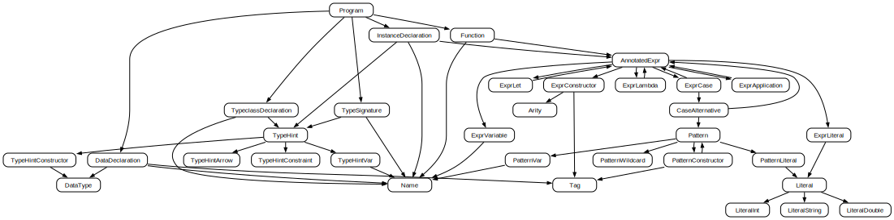

# Doldrums

&ldquo;You can swim all day in the Sea of Knowledge and not get wet.&rdquo;

&ndash; Norton Juster, _The Phantom Tollbooth_

## About

Doldrums is a small, purely functional programming language with an emphasis on ease of top-to-bottom understanding. It's like a tiny Haskell. It's been a great way for me to learn about Haskell, compilers, parsing, typechecking, runtime evaluation, and more.

The compiler is written in Haskell. Use `cabal run doldrums -- tour.dol` to run an example program, or `cabal run doldrums-test` to see what programs are currently working. `cabal haddock --open` will show the documentation.

There are many examples of working programs in `test/expect/*.dol` (and expectedly broken ones in `test/broken/*.dol`).

### Structure

Compilation is split into several stages, and the code is split as well. The AST definition of the language lives in the `Language` module. Parsing happens in `Parse`, that syntax tree is fixed by `FixAst` and typechecking happens in `Typecheck`. The `Interpret` module actually evaluates the program. 

The `Graphviz` module produces visualizations of `Expr` syntax trees, useful for debugging or inspection. `STG` lowers Doldrums `Expr` to the spineless tagless G-machine, which is what Haskell does with its `Core` (before Cmm and LLVM).

The `runBase` function in `Lib` performs each stage of the compilation pipeline. In order, it parses a small prelude (written in Doldrums), reads an input file, parses, typechecks, evaluates, and shows the program's result.

## The Doldrums language

### Comments

```hs
-- Line comments look like this
```

```hs
{- Block comments
   look like this -}
```

### Writing a program

A program is a list of functions. A function has a name, a list of arguments, a body, and optionally a type signature.

```hs
id :: a -> a
id x = x

const :: a -> b -> a
const x y = x
```

Define constants using a "function" with no arguments.
```hs
seven :: Int
seven = 7
```

Every program has a main function. This is what runs when the program starts.
```hs
main :: IO ()
main = print $ const 6 7
```

### The $ operator

Because it has the lowest precedence, we can use `$` to replace parentheses in certain situations, for cleaner code. For example, 

```hs
main = f (g (h x))
```

is equivalent to

```hs
main = f $ g $ h x
```

which is also equivalent to using `.` for function composition

```hs
main = f . g $ h x
```

### Let and where expressions

Define variables to be used in an expression with `let`...`in`
```hs
let
  n = 0
in n
```

Multiple definitions are allowed. Thanks to non-strict evaluation, they can be defined "out of order" or even be mutually recursive.
```hs
let
  a = 1
  d = c * 2
  b = 2
  c = 3
in
  a - b * c + d
```

Use the `where` keyword for definitions that come after an expression. 
```hs
f = x + y
  where
    x = y * 2
    y = 7
```

### Algebraic datatypes

Introduce user-defined types and values with `data` declarations. These are "sum of products" algebraic types, allowing type variables.

```hs
data Bool = True | False

data List a = Nil | Cons a (List a)

data Either a b = Left a | Right b
```

`deriving` clauses are supported for some common typeclasses. They do code generation to write the `instance` declaration automatically.

```hs
data Color = Red | Green | Blue
  deriving (Eq, Ord, Show)
```

### Case expressions

Use `case` to pattern match on variables, literals, and user-defined constructors. The wildcard pattern `_` matches anything. (Note that hanging indentation is supported here, and on other syntax like `let` binding blocks.)

```hs
fib :: Int -> Int
fib n = case n of
  0 -> 1
  1 -> 1
  _ -> fib (n - 1) + fib (n - 2)
```

Alternatively, use multiple top-level definitions with different pattern matches:

```hs
fib :: Int -> Int
fib 0 = 1
fib 1 = 1
fib n = fib (n - 1) + fib (n - 2)
```

`LambdaCase` is supported as well. These are equivalent:

```hs
f x = case x of ...

f = \case ...
```

### Guards

Guard clauses provide a convenient way to evaluate multiple boolean conditions. `otherwise` is a synonym for `True`, defined in the Doldrums Prelude.

```hs
abs n :: Num a => a -> a
abs n
  | n > 0 = n
  | n < 0 = -n
  | otherwise = 0
```

### Typeclasses

User-defined typeclasses and instances of those classes are supported. Basic classes like `Eq`, `Ord`, `Num`, `Semigroup`, and `Show` come pre-defined in `Prelude.dol`, with primitive operations supported by the parser and interpreter.

```hs
class Equal a where
  eq :: a -> a -> Bool

instance Equal Int where
  eq x y = x == y

instance Equal Bool where
  eq True  True  = True
  eq False False = True
  eq _     _     = False
```

Constraint syntax allows building typeclass hierarchies and reusing methods on subexpressions.

```hs
class Semigroup a => Monoid a where
  mempty :: a

instance Eq a => Eq (Pair a) where
  ...
```

### Lexical negation

For ease of dealing with numeric values, lexical negation is supported.

```hs
f -7   -- applies f to negative seven
f - 7  -- subtracts seven from f
```

### List syntax

Square bracket list syntax is supported for expressions, pattern matches, and type signatures. `:` is equivalent to `Cons`. The `..` syntax allows for list ranges.

```hs
[]
(x:xs)
[Int]
[1,3..10]
```

### Records

Record syntax is supported in data declarations, producing accessor functions.

```hs
data Person = Person { name :: String, age :: Int }
```

Record fields can be accessed with `OverloadedRecordDot`-style dot notation, or with `RecordWildCards`-style expansions.

```hs
somePerson.name
Person{..}
```

Record update syntax works too:

```hs
somePerson { age = age + 1 }
```

### Typed holes

Variable names starting with `_` are typed holes. The typechecker will call out their locations and possible types. These can be useful when writing programs as a way to make partial progress.

```hs
_
_myTypedHole
x + _y
```

### Backticks for infix functions

Backticks let us use normal prefix functions as infix operators.

```hs
x = 10 `mod` 2
```

### Operator sections

Operator sections let us apply any combination of the arguments to an infix operator.

```hs
(+1) -- right
(1+) -- left
1+1  -- both
(+)  -- neither
```

### Do notation

Use the `do` keyword for multi-line expressions that desugar to usage of the (>>=) bind operator.

```hs
main :: IO ()
main = do
  putStrLn "Hello, what's your name?"
  name <- getLine
  putStrLn $ "Nice to meet you, " <> name
```

## Parsing

The parser uses [Megaparsec](https://hackage.haskell.org/package/megaparsec) and [`makeExprParser`](https://hackage.haskell.org/package/parser-combinators-1.3.0/docs/Control-Monad-Combinators-Expr.html#v:makeExprParser) from `parser-combinators`.

Here's a simplified call graph of the parsing code, showing its structure:



## Typechecking

The list of built-in Doldrums types is short: `Int`, `Double`, `String`, `Tagged` (for user-defined datatypes), `TypeVariable`, and `:->` (the function type).

`Prelude.dol` defines `Bool`, `Ordering`, `Unit`, `Maybe`, `Either`, and `List` types.

Doldrums uses Hindley-Milner style type inference to ensure that certain kinds of invalid programs aren't allowed. For example, this program will fail to typecheck:

```hs
func x = x + 7

main = func "hello"
```

So will this one, since integer literals can't be applied as functions:

```hs
main = 1 2 3
```

## Operator Fixities

Higher numbers mean higher precedence.

Precedence | Associativity | Operator
-----------|---------------|---------
10         | left          | _function application_
9          | right         | `.`
7          | left          | `*`
7          | left          | `/`
6          | left          | `+`
6          | left          | `-`
5          | right         | `:`
5          | right         | `<>`
4          | _none_        | `==`
4          | _none_        | `/=`
4          | _none_        | `>`
4          | _none_        | `>=`
4          | _none_        | `<`
4          | _none_        | `<=`
3          | right         | `&&`
2          | right         | `\|\|`
0          | right         | `$`

## Some helpful resources if you want to do something like this

I'd recommend using Megaparsec or another parsing library to make that part easier to write. I learned a lot of this from [Implementing Functional Languages: a tutorial](https://www.microsoft.com/en-us/research/publication/implementing-functional-languages-a-tutorial). The talk [Statically Typed Interpreters](https://www.youtube.com/watch?v=Ci2KF5hVuEs) was helpful when figuring out how to add the initial typechecking. Some issues were debugged more quickly thanks to help from friends. [Algorithm W Step by Step](https://citeseerx.ist.psu.edu/viewdoc/download?doi=10.1.1.65.7733&rep=rep1&type=pdf) helped me upgrade the typechecking to Hindley-Milner style inference.
